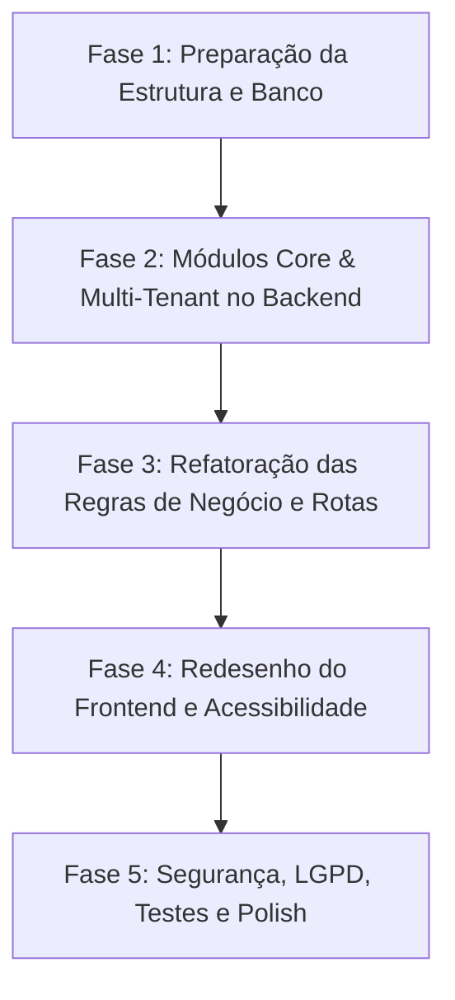

# Auditoria Completa do Sistema Legado (PAPSE)

Este documento apresenta uma auditoria detalhada e completa do projeto herdado, mapeando todas as referências ao sistema anterior (**PAPSE - Programa de Acompanhamento Psicológico Estudantil**) e identificando pontos de reestruturação de código, riscos de segurança, riscos de privacidade (LGPD), riscos de propriedade intelectual/similaridade com o artigo de origem, e propondo o plano de refatoração para a transição completa para a nova plataforma **NeuroAcolhe**.

---

## 1. Mapeamento de Termos e Conceitos Legados

O sistema atual foi construído com foco estrito em um programa institucional da UNIFESSPA (FAPSI/FACSI). A tabela abaixo consolida os conceitos que serão descaracterizados e seus substitutos no domínio do **NeuroAcolhe**:

| Conceito Legado (PAPSE) | Descrição do Conceito Legado | Novo Domínio Alvo (NeuroAcolhe) |
| :--- | :--- | :--- |
| **PAPSE** | Nome do programa de acompanhamento estudantil. | **NeuroAcolhe** |
| **Bolsista / Voluntário** | Discente de psicologia que realiza o atendimento. | **Professional** (Profissional de Saúde) |
| **Colaborador** | Nome genérico da entidade de usuário interno (Admin ou Bolsista). | **User** (Usuário da Plataforma) |
| **Paciente** | Aluno atendido (vinculado a matrícula/curso). | **Patient** (Paciente/Acolhido, desacoplado de universidade) |
| **Lista de Espera** | Primeira etapa de triagem de pacientes. | **CareQueue** (Fila de Cuidado - Status: *Recebido* / *Aguardando*) |
| **Espera Regular / Lista Regular**| Fila intermediária após triagem inicial. | **CareQueue** (Fila de Cuidado - Status: *Aguardando Atendimento*) |
| **Protocolo (Atendimento)** | Modalidade de atendimento de curta duração. | **CareCase** (Caso de Acompanhamento - Tipo: *Protocolo / Curta Duração*) |
| **Regular (Atendimento)** | Modalidade de acompanhamento tradicional. | **CareCase** (Caso de Acompanhamento - Tipo: *Regular / Longo Prazo*) |
| **Relatório Evolutivo** | Registros de sessões clínicas por paciente. | **SessionNote** (Evolução de Sessão) |
| **Histórico** | Registro de desligamento/encerramento de caso. | **CareCase** (Caso com Status: *Finalizado / Arquivado*) |
| **Docente/Coordenador** | Usuário administrador (sem modelo de supervisor). | **Supervisor** (Supervisor Clínico - Novo Perfil dedicado) |
| *Não Existente* | Falta isolamento de clínicas/instituições. | **Institution** (Multi-tenant/Organização) |

---

## 2. Inventário Técnico de Referências ao PAPSE

### A. Nomes de Pastas
* **`Backend_Papse`**: Pasta raiz do backend (`/Backend_Papse`). Deve ser unificada em uma estrutura monorepo ou renomeada para `api` ou `apps/api`.
* **`Backend_Papse/src/@types/espress`**: Pasta com erro de grafia (`espress` em vez de `express`). Deve ser renomeada e reestruturada.
* **`Frontend`**: Pasta raiz do frontend. Deve ser renomeada para `web` ou `apps/web`.

### B. Nomes de Arquivos
Todos os arquivos abaixo contêm referências explícitas ao PAPSE ou sua terminologia e deverão ser deletados ou renomeados na refatoração:

#### Backend (Rotas, Controllers e Services)
* **Rotas**:
  * [colaborador.routes.ts](file:///Users/gustavoborges/Desktop/neuroacolhe-centelha-main/Backend_Papse/src/routes/colaborador.routes.ts)
  * [historico.routes.ts](file:///Users/gustavoborges/Desktop/neuroacolhe-centelha-main/Backend_Papse/src/routes/historico.routes.ts)
  * [listaEspera.routes.ts](file:///Users/gustavoborges/Desktop/neuroacolhe-centelha-main/Backend_Papse/src/routes/listaEspera.routes.ts)
  * [listaRegular.routes.ts](file:///Users/gustavoborges/Desktop/neuroacolhe-centelha-main/Backend_Papse/src/routes/listaRegular.routes.ts)
  * [paciente.routes.ts](file:///Users/gustavoborges/Desktop/neuroacolhe-centelha-main/Backend_Papse/src/routes/paciente.routes.ts)
  * [protocolo.routes.ts](file:///Users/gustavoborges/Desktop/neuroacolhe-centelha-main/Backend_Papse/src/routes/protocolo.routes.ts)
  * [regular.routes.ts](file:///Users/gustavoborges/Desktop/neuroacolhe-centelha-main/Backend_Papse/src/routes/regular.routes.ts)
  * [relatorio.routes.ts](file:///Users/gustavoborges/Desktop/neuroacolhe-centelha-main/Backend_Papse/src/routes/relatorio.routes.ts)
* **Controllers**:
  * [colaborador.controller.ts](file:///Users/gustavoborges/Desktop/neuroacolhe-centelha-main/Backend_Papse/src/controllers/colaborador.controller.ts)
  * [historico.controller.ts](file:///Users/gustavoborges/Desktop/neuroacolhe-centelha-main/Backend_Papse/src/controllers/historico.controller.ts)
  * [listaEspera.controller.ts](file:///Users/gustavoborges/Desktop/neuroacolhe-centelha-main/Backend_Papse/src/controllers/listaEspera.controller.ts)
  * [listaRegular.controller.ts](file:///Users/gustavoborges/Desktop/neuroacolhe-centelha-main/Backend_Papse/src/controllers/listaRegular.controller.ts)
  * [paciente.controller.ts](file:///Users/gustavoborges/Desktop/neuroacolhe-centelha-main/Backend_Papse/src/controllers/paciente.controller.ts)
  * [protocolo.controller.ts](file:///Users/gustavoborges/Desktop/neuroacolhe-centelha-main/Backend_Papse/src/controllers/protocolo.controller.ts)
  * [regular.controller.ts](file:///Users/gustavoborges/Desktop/neuroacolhe-centelha-main/Backend_Papse/src/controllers/regular.controller.ts)
  * [relatorio.controller.ts](file:///Users/gustavoborges/Desktop/neuroacolhe-centelha-main/Backend_Papse/src/controllers/relatorio.controller.ts)
* **Services**:
  * [colaborador.service.ts](file:///Users/gustavoborges/Desktop/neuroacolhe-centelha-main/Backend_Papse/src/services/colaborador.service.ts)
  * [historico.service.ts](file:///Users/gustavoborges/Desktop/neuroacolhe-centelha-main/Backend_Papse/src/services/historico.service.ts)
  * [listaEspera.service.ts](file:///Users/gustavoborges/Desktop/neuroacolhe-centelha-main/Backend_Papse/src/services/listaEspera.service.ts)
  * [listaRegular.service.ts](file:///Users/gustavoborges/Desktop/neuroacolhe-centelha-main/Backend_Papse/src/services/listaRegular.service.ts)
  * [paciente.service.ts](file:///Users/gustavoborges/Desktop/neuroacolhe-centelha-main/Backend_Papse/src/services/paciente.service.ts)
  * [protocolo.service.ts](file:///Users/gustavoborges/Desktop/neuroacolhe-centelha-main/Backend_Papse/src/services/protocolo.service.ts)
  * [regular.service.ts](file:///Users/gustavoborges/Desktop/neuroacolhe-centelha-main/Backend_Papse/src/services/regular.service.ts)
  * [relatorio.service.ts](file:///Users/gustavoborges/Desktop/neuroacolhe-centelha-main/Backend_Papse/src/services/relatorio.service.ts)
* **Prisma Generated (Versionado incorretamente)**:
  * Toda a pasta [generated](file:///Users/gustavoborges/Desktop/neuroacolhe-centelha-main/Backend_Papse/src/generated) no backend deve ser removida do Git.
* **Scripts Úteis**:
  * [reset-pass.ts](file:///Users/gustavoborges/Desktop/neuroacolhe-centelha-main/Backend_Papse/reset-pass.ts) e [debug_check.ts](file:///Users/gustavoborges/Desktop/neuroacolhe-centelha-main/Backend_Papse/src/debug_check.ts) que usam conexões e enums legados.

#### Frontend (Páginas e Backups)
* [Bolsista.tsx](file:///Users/gustavoborges/Desktop/neuroacolhe-centelha-main/Frontend/src/pages/Bolsista.tsx): Painel operacional do discente.
* [relatorio.tsx](file:///Users/gustavoborges/Desktop/neuroacolhe-centelha-main/Frontend/src/pages/relatorio.tsx): Relatórios de encerramento legados.
* [Formulario.tsx](file:///Users/gustavoborges/Desktop/neuroacolhe-centelha-main/Frontend/src/pages/Formulario.tsx): Ficha de triagem pública de estudantes.
* [api.ts.save](file:///Users/gustavoborges/Desktop/neuroacolhe-centelha-main/Frontend/src/services/api.ts.save): Arquivo de backup a ser excluído.

#### Docker e Configurações de Infraestrutura
* [Backend_Papse/docker-compose.yml](file:///Users/gustavoborges/Desktop/neuroacolhe-centelha-main/Backend_Papse/docker-compose.yml): Define o contêiner `api-papse` e a rede `papse_network`.
* [Frontend/docker-compose.yml](file:///Users/gustavoborges/Desktop/neuroacolhe-centelha-main/Frontend/docker-compose.yml): Define o contêiner `frontend-papse` e a rede `papse_network`.


### C. Arquivos de Documentação (READMEs)
* [README.md (Raiz)](file:///Users/gustavoborges/Desktop/neuroacolhe-centelha-main/README.md): Apresenta o projeto como "Programa de Acompanhamento Psicológico Estudantil", detalhando as tecnologias baseadas na clonagem do repositório `backend-papse.git`, menções à UNIFESSPA nos créditos e licenciamento.
* [README.md (Backend)](file:///Users/gustavoborges/Desktop/neuroacolhe-centelha-main/Backend_Papse/README.md): Apresenta o projeto como "WEBII - PAPSE" com instruções de Docker direcionadas à base `papse_db`.

### D. Textos de Interface e UI
Mapeamento de textos hardcoded nas páginas do Frontend que serão reescritos:
* **Títulos de Páginas / Headers**:
  * `"PAPSE | Painel Administrativo"` (em [AdministrativePanel.tsx](file:///Users/gustavoborges/Desktop/neuroacolhe-centelha-main/Frontend/src/pages/AdministrativePanel.tsx#L11))
  * `"PAPSE | Painel do Bolsista"` (em [Bolsista.tsx](file:///Users/gustavoborges/Desktop/neuroacolhe-centelha-main/Frontend/src/pages/Bolsista.tsx#L169))
  * Logo textual `"PAPSE"` nos cabeçalhos de lista (em [Historico.tsx](file:///Users/gustavoborges/Desktop/neuroacolhe-centelha-main/Frontend/src/pages/Historico.tsx#L148) e [PatientList.tsx](file:///Users/gustavoborges/Desktop/neuroacolhe-centelha-main/Frontend/src/pages/PatientList.tsx#L324))
* **Página Principal (Home.tsx)**:
  * Título: `"PROGRAMA DE ACOMPANHAMENTO PSICOLÓGICO ESTUDANTIL"` (em [Home.tsx](file:///Users/gustavoborges/Desktop/neuroacolhe-centelha-main/Frontend/src/pages/Home.tsx#L42-L44))
  * Rodapé: `"Projeto desenvolvido pelo FAPSI em conjunto com a FACSI da Universidade Federal do Sul e Sudeste do Pará"` (em [Home.tsx](file:///Users/gustavoborges/Desktop/neuroacolhe-centelha-main/Frontend/src/pages/Home.tsx#L68-L70))
* **Página Sobre**:
  * Todo o conteúdo da página [Sobre.tsx](file:///Users/gustavoborges/Desktop/neuroacolhe-centelha-main/Frontend/src/pages/Sobre.tsx), que detalha as origens do PAPSE, o envolvimento do FAPSI/FACSI e a finalidade de "permanência estudantil" na UNIFESSPA.
* **Formulário de Inscrição**:
  * Título: `"Ficha de Inscrição"`
  * Mensagem de Sucesso: `"A equipe do PAPSE entrará em contato em breve..."` (em [Formulario.tsx](file:///Users/gustavoborges/Desktop/neuroacolhe-centelha-main/Frontend/src/pages/Formulario.tsx#L446-L447))
  * Termo de Aceite LGPD: `"autorizo o sistema PAPSE a tratar meus dados..."` (em [Formulario.tsx](file:///Users/gustavoborges/Desktop/neuroacolhe-centelha-main/Frontend/src/pages/Formulario.tsx#L344))
* **Outros**:
  * Placeholder `"Ex: joao@projetopapse.org"` em [Collaborators.tsx](file:///Users/gustavoborges/Desktop/neuroacolhe-centelha-main/Frontend/src/pages/Collaborators.tsx#L395).


### E. Rotas e Endpoints
As rotas legadas estão mapeadas de forma plana e direta na URL `/api`. O NeuroAcolhe deve adotar uma estrutura modular com prefixos limpos.

#### Backend (`/api/...`):
* `/api/login` (Auth)
* `/api/esqueci-senha` (Auth)
* `/api/redefinir-senha` (Auth)
* `/api/pacientes` (Pacientes - triagem e cadastros)
* `/api/listaespera` (Fila inicial)
* `/api/listaregular` (Fila de espera para bolsistas regulares)
* `/api/protocolos` (Controle de atendimentos curtos)
* `/api/regular` (Controle de atendimentos regulares)
* `/api/colaboradores` (Controle de usuários internos)
* `/api/historico` (Registros de desligamentos)
* `/api/relatorios` (Evoluções de sessões - endpoint mapeado para `/api/relatorios`)

#### Frontend:
* `/` (Home/Landing Page)
* `/sobre` (Sobre o sistema)
* `/formulario` (Ficha de triagem)
* `/login` (Tela de autenticação)
* `/admin` (Painel principal)
  * `/admin/gerenciamento-colaboradores`
  * `/admin/relatorios`
  * `/admin/historico`
  * `/admin/lista-espera`
  * `/admin/lista-espera-atendimento-regular`
  * `/admin/lista-atendimento-protocolo`
  * `/admin/lista-atendimento-regular`
* `/bolsista` (Painel operacional do aluno)

---

## 3. Modelo de Banco de Dados e Prisma

O banco de dados legado foi modelado no arquivo [schema.prisma](file:///Users/gustavoborges/Desktop/neuroacolhe-centelha-main/Backend_Papse/prisma/schema.prisma) sob uma estrutura de **Single-Tenant** (tabelas únicas e compartilhadas globalmente) para MySQL.

### Entidades Atuais vs Propostas (Prisma)

A tabela abaixo contrasta a modelagem antiga com a nova arquitetura multitenant (SaaS) planejada para o **NeuroAcolhe**:

| Tabela Legada | Atributos e Relações Críticas | Nova Entidade | Melhoria Arquitetural |
| :--- | :--- | :--- | :--- |
| **`Paciente`** | `nome`, `email`, `matricula` (id estudantil), `curso`, `relato` (dado sensível), `termo_lgpd`, `ip_origem`. Relações com todas as tabelas de fluxo por chaves estrangeiras. | **`Patient`** | Remove dependência acadêmica (`matricula`, `curso`). Adiciona vínculo obrigatório à tabela **`Institution`** (`institutionId`). Introduz relacionamento com **`AccessibilityProfile`** e **`ConsentRecord`**. |
| **`Colaborador`**| `idBolsista` (chave), `nome`, `matricula`, `email`, `senha` (hash), `role` (ADMIN, BOLSISTA). | **`User`** | Modifica perfis para: `PLATFORM_ADMIN`, `INSTITUTION_ADMIN`, `PROFESSIONAL`, `SUPERVISOR`. Inclui vínculo a uma **`Institution`**. |
| **`ListaEspera`**| `idListaEspera`, `idPaciente`. Tabela pivot simples para controlar fila. | **`CareQueue`** | Tabela unificada de fila de atendimento, controlando o status do paciente por transição de estados lógica, com tempo de permanência e alertas automáticos de abandono. |
| **`ListaRegular`**| `idListaRegular`, `idPaciente`, `idBolsista`. Controla fila secundária. | *Removido* | Unificado na **`CareQueue`** com status lógicos, evitando duplicação física de tabelas para representar etapas. |
| **`Protocolo`** | `idProtocolo`, `data_inicio`, `qtde_sessoes`, `idPaciente`, `idBolsista`. | **`CareCase`** | Entidade genérica para representar casos clínicos de acompanhamento, permitindo customizar o tipo (*curto prazo/protocolo* ou *longo prazo/regular*) de forma parametrizada. |
| **`Regular`** | `idRegular`, `data_inicio`, `qtde_sessoes`, `idPaciente`, `idBolsista`. | *Removido* | Unificado na entidade **`CareCase`**. |
| **`RelatorioEvolutivo`** | `idRelatorio`, `texto` (clínico), `data_criacao`, `idPaciente`, `idBolsista`. | **`SessionNote`** | Evoluções clínicas com hash de integridade, controle de auditoria de quem leu/escreveu, e vinculação com supervisões. |
| **`Historico`** | `idHistorico`, `data_desligamento`, `idPaciente`, `id_ultimo_bolsista`. | *Removido* | Unificado como histórico de transição de status em **`CareCase`** e logs de auditoria. |
| *Inexistente* | Sem controle de isolamento de dados. | **`Institution`** | Tabela âncora para o modelo **Multi-Tenant** (identifica a clínica, universidade ou escola de psicologia). |
| *Inexistente* | Sem registros detalhados de supervisão clínica. | **`SupervisionNote`** | Registros de orientações emitidas por docentes/supervisores sobre os casos dos profissionais/alunos. |
| *Inexistente* | Sem termos de LGPD auditáveis e históricos. | **`ConsentRecord`** | Armazena histórico detalhado do aceite (IP, versão do termo, navegador, data/hora). |
| *Inexistente* | Sem registros de auditoria interna. | **`AuditLog`** | Registro imutável de todas as ações sensíveis realizadas na plataforma (leitura de prontuários, login, exportações). |

---

## 4. Análise de Seeds e Dados de Teste

O arquivo [seed.ts](file:///Users/gustavoborges/Desktop/neuroacolhe-centelha-main/Backend_Papse/prisma/seed.ts) contém os seguintes elementos vinculados à estrutura legada do PAPSE:
1. **Foco Acadêmico e Territorial**: O seed gera dados para 20 alunos com cursos acadêmicos específicos da UNIFESSPA (armazenados no vetor `CURSOS_UNIFESSPA` contendo 46 opções como Zootecnia, Geologia, Computação, Engenharia de Minas, etc.).
2. **Nomes de variáveis**: `bolsistas`, `bolsistaResponsavel`, `pacientesData` e loops dedicados a povoar as tabelas físicas segmentadas (`listaEspera`, `listaRegular`, `protocolo`, `regular`, `historico`).
3. **Terminologia nos Logs**: Logs em console como `👨‍⚕️ Foram encontrados bolsistas para distribuir os pacientes.` e `[x/20] Nome -> Espera Regular (Bolsista: Nome)`.

---

## 5. Variáveis, Tipos e Componentes no Código

### A. Variáveis no LocalStorage e Configurações
* **LocalStorage Keys**: O frontend salva o estado da sessão nas chaves `@Papse:user` e `@Papse:token` ([AuthContext.tsx](file:///Users/gustavoborges/Desktop/neuroacolhe-centelha-main/Frontend/src/contexts/AuthContext.tsx#L26-L27)). Isso deve ser modificado para `@NeuroAcolhe:user` e `@NeuroAcolhe:token`.
* **API URLs**: O frontend usa a URL `https://api.projetopapse.org/api` como fallback caso `VITE_API_URL` não esteja definido ([api.ts](file:///Users/gustavoborges/Desktop/neuroacolhe-centelha-main/Frontend/src/services/api.ts#L8)).

### B. Tipos e Enums do TypeScript
* **Roles**: O enum `Role` possui apenas dois valores: `ADMIN` e `BOLSISTA`.
* **Relações do Prisma**: Tipos autogerados baseados nos nomes de modelo antigos (`Paciente`, `Colaborador`, etc.).

### C. Componentes e Telas (Estrutura UI)
* A navegação principal e os menus administrativos estão consolidados em [TabNavigationAdmin.tsx](file:///Users/gustavoborges/Desktop/neuroacolhe-centelha-main/Frontend/src/components/layout/TabNavigationAdmin.tsx) e [HeaderMenu.tsx](file:///Users/gustavoborges/Desktop/neuroacolhe-centelha-main/Frontend/src/components/shared/HeaderMenu.tsx), que contêm links explícitos para o modelo conceitual antigo de listas.
* O [PatientCard.tsx](file:///Users/gustavoborges/Desktop/neuroacolhe-centelha-main/Frontend/src/components/shared/PatientCard.tsx) exibe a label `Resp: {bolsistaNome}` e controla as cores e transições associadas às listas acadêmicas.

---

## 6. Regras de Negócio e Jornada do Usuário

O projeto legado segue as seguintes regras de negócio que limitam sua escalabilidade e validade comercial:
1. **Triagem Restrita**: O preenchimento da triagem exige obrigatoriamente a seleção de um curso universitário pré-cadastrado e o preenchimento de uma matrícula acadêmica de estudante.
2. **Fluxo Rígido de Status**: O paciente é movido em uma ordem inflexível de tabelas:
   * Cadastro (Lista de Espera) $\rightarrow$ Triagem em Protocolo (Atendimento Curto) $\rightarrow$ Espera Regular (Lista Secundária) $\rightarrow$ Atendimento Regular $\rightarrow$ Desligado (Histórico).
   * No **NeuroAcolhe**, o fluxo deve ser dinâmico e focado em estágios lógicos ajustáveis por cada instituição, acompanhado de supervisões periódicas.
3. **Prontuário Simples (Sem Sigilo de Auditoria)**: Qualquer bolsista cadastrado pode visualizar o prontuário e histórico de todos os pacientes e ver/criar relatórios, mesmo que não seja o profissional responsável associado, expondo dados confidenciais a terceiros.

---

## 7. Matriz de Riscos: Segurança, LGPD e Propriedade Intelectual

### A. Riscos de Segurança (Técnicos)

> [!WARNING]
> A API atual possui vulnerabilidades críticas de infraestrutura e criptografia que precisam ser mitigadas imediatamente.

* **Falta de Isolamento (Sem Multi-Tenancy)**: Não há separação lógica de dados. Se duas clínicas utilizarem a plataforma, todos os profissionais compartilharão a mesma lista de pacientes e relatórios clínicos.
* **CORS Excessivamente Aberto**: Em [server.ts](file:///Users/gustavoborges/Desktop/neuroacolhe-centelha-main/Backend_Papse/src/server.ts#L19), a API declara `app.use(cors())` sem nenhuma restrição de origem, permitindo que qualquer domínio externo execute chamadas maliciosas.
* **Segredos Hardcoded no Código**: A chave pública do Google reCAPTCHA v3 está hardcoded no arquivo do React [App.tsx](file:///Users/gustavoborges/Desktop/neuroacolhe-centelha-main/Frontend/src/App.tsx#L23). Deveria ser consumida via variáveis de ambiente (`.env`).
* **Inexistência de Rate Limit**: As rotas públicas de login e de cadastro de triagem não contam com controle de requisições por IP, permitindo ataques de brute-force e injeção massiva de cadastros falsos (bots).
* **Ausência de Headers de Segurança**: A API não implementa o middleware **Helmet** para configurar cabeçalhos HTTP de proteção contra Clickjacking, XSS e sniffers de MIME-type.
* **Tokens de Redefinição Fracos**: O fluxo de esqueci-senha utiliza links enviados por e-mail com tokens simples de uso único, sem hashes criptográficos avançados no armazenamento do banco ou expiração robusta.

### B. Riscos de LGPD (Privacidade de Dados de Saúde)

> [!CAUTION]
> O prontuário psicológico armazena dados de saúde mental, classificados como **Dados Pessoais Sensíveis** sob o Artigo 5º, inciso II da LGPD. O tratamento atual viola preceitos fundamentais da lei.

* **Inexistência de Trilha de Auditoria (Audit Log)**: Qualquer visualização ou leitura de prontuário, exclusão de paciente ou download de relatório não é registrada em logs. É impossível saber quem visualizou as informações confidenciais do paciente e quando.
* **Gestão de Consentimento Frágil**: A aceitação dos termos da LGPD é salva como um booleano simples `termo_lgpd: true` no banco. Para plena validade jurídica, é obrigatório registrar a data/hora exata, o IP de origem e o ID da versão específica do termo aceito pelo paciente.
* **Falta de Direitos do Titular (Art. 18)**: Não há mecanismos construídos para anonimização, exclusão definitiva (direito ao esquecimento) ou portabilidade dos dados confidenciais mediante requisição do paciente.
* **Visualização Irrestrita**: Prontuários clínicos e relatos íntimos de sofrimento mental não possuem mascaramento ou restrições rígidas baseadas no profissional diretamente responsável ou supervisor autorizado.

### C. Riscos de Similaridade com o Artigo Original

> [!IMPORTANT]
> O projeto original foi desenvolvido como produto de uma pesquisa acadêmica da UNIFESSPA. A manutenção direta das nomenclaturas, estrutura e fluxos idênticos pode configurar plágio intelectual e infração de direitos de propriedade intelectual da universidade.

* **Falta de Domínio Comercial**: O foco rígido em bolsas e universidade impede a comercialização do sistema sob a modalidade SaaS (SaaS B2B para clínicas de psicologia privadas e clínicas-escola de outras instituições).
* **Estrutura Idêntica**: Manter as mesmas telas com as mesmas disposições, nomes de listagens e descrições do projeto original impede a originalidade e a consolidação de uma nova identidade para o **NeuroAcolhe**.

---

## 8. Plano de Refatoração em Etapas (Migration Roadmap)

Para garantir uma transformação segura e sem quebras no funcionamento local, a transição será dividida em 5 fases lógicas:



### Fase 1: Preparação da Estrutura e Banco de Dados (Database & Monorepo)
1. **Estruturar Diretórios**:
   * Adotar a arquitetura recomendada de pastas:
     ```txt
     neuroacolhe-platform/ (raiz)
       apps/
         api/ (antigo Backend_Papse)
         web/ (antigo Frontend)
       docs/ (documentação)
     ```
2. **Novo Schema Prisma**:
   * Substituir o banco MySQL local por PostgreSQL no `schema.prisma`.
   * Criar os novos models: `Institution`, `User`, `Patient`, `IntakeForm`, `CareQueue`, `CareCase`, `SessionNote`, `SupervisionNote`, `AccessibilityProfile`, `Alert`, `ConsentRecord` e `AuditLog`.
   * Remover do histórico do Git e deletar a pasta `src/generated` antiga, gerando o client sob demanda na pasta padrão (`node_modules/.prisma`).
3. **Novo Script de Seed**:
   * Desenvolver um seed limpo focado em duas organizações realistas: uma clínica-escola universitária fictícia e uma clínica privada, povoando usuários profissionais, supervisores, pacientes e evoluções neutras, sem nomes ou termos antigos do PAPSE.

### Fase 2: Módulos Core & Multi-Tenant no Backend
1. **Implementar Multi-Tenancy**:
   * Modificar todos os middlewares para validar a instituição de origem do usuário logado (`req.user.institutionId`).
   * Garantir que qualquer query SQL gerada pelo Prisma filtre automaticamente por `institutionId` para isolar os dados das clínicas.
2. **Módulos do Sistema**:
   * Dividir o backend em pastas modulares contendo `routes`, `controller`, `service`, `schema/validation` e `tests` para cada uma das entidades core (auth, institutions, users, patients, intake, care-cases, session-notes, supervision, alerts, audit).

### Fase 3: Refatoração das Regras de Negócio e Rotas
1. **Desacoplamento Acadêmico**:
   * Remover os campos de matrícula e curso dos fluxos de triagem e perfil.
   * Introduzir o formulário de triagem em etapas, com validação via **Zod** no backend.
2. **Fila e Acompanhamento Lógicos**:
   * Migrar as tabelas de fila e atendimentos rígidos para registros de fila lógica (`CareQueue`) e casos (`CareCase`), controlando o tipo de acompanhamento por parâmetro.
3. **Fluxo de Supervisão Clínica**:
   * Desenvolver rotas e regras onde alunos ou profissionais de saúde submetem evoluções de sessão que aguardam orientações/supervisões dos docentes ou supervisores clínicos vinculados.

### Fase 4: Redesenho do Frontend (Interface NeuroAcolhe)
1. **Remoção de Referências e Layouts**:
   * Substituir logos, textos de rodapé, páginas Sobre e referências do LocalStorage (`@Papse` $\rightarrow$ `@NeuroAcolhe`).
2. **Design System Moderno**:
   * Atualizar os componentes de layout do React com design responsivo premium (vibrante, com suporte a modo escuro, cores curadas e micro-animações).
3. **Acessibilidade Inclusiva**:
   * Implementar foco em acessibilidade para pessoas neurodivergentes (linguagem simples, suporte a leitores de tela, contrastes adequados e campos limpos de formulário na triagem).

### Fase 5: Segurança, LGPD, Testes e Polimento
1. **Criptografia e Validações**:
   * Adicionar **Helmet** para proteção de cabeçalhos.
   * Configurar **rate limit** para as rotas públicas de triagem e autenticação.
   * Restringir o **CORS** utilizando origens definidas por variáveis de ambiente.
2. **Privacidade (LGPD)**:
   * Criar a tabela `AuditLog` e injetar um interceptor ou middleware para salvar logs de leitura e escrita de prontuários.
   * Implementar criptografia simples ou mascaramento em campos de prontuário, além da funcionalidade de revogação de termos de consentimento.
3. **Testes Automatizados**:
   * Desenvolver testes automatizados (Vitest/Jest) cobrindo criação de instituições, isolamento de dados de tenant, permissões de perfis (RBAC), envio de triagem pública e registro de evoluções.
