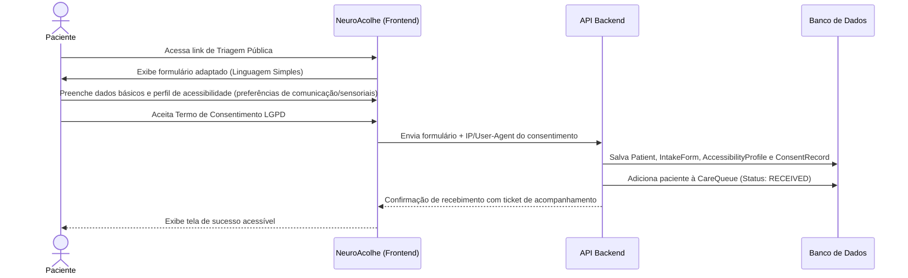
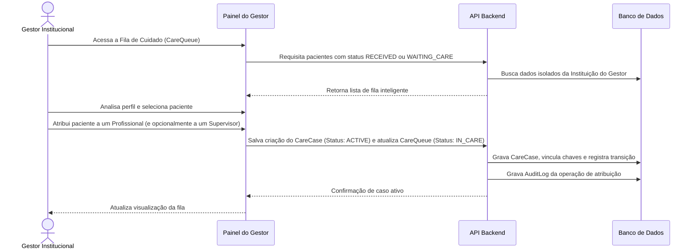
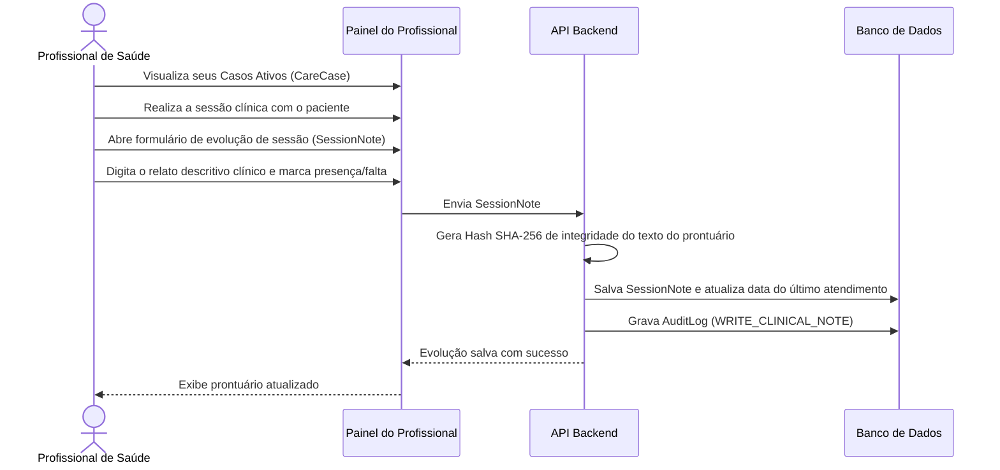
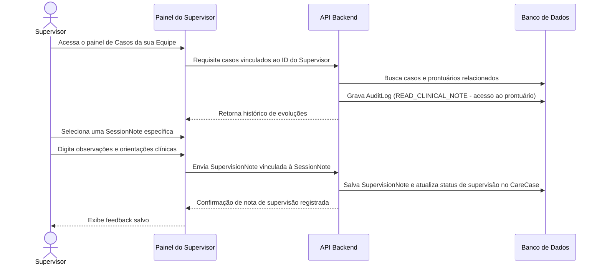

# Jornada de Usuário — NeuroAcolhe

Este documento mapeia o fluxo ponta-a-ponta da jornada do usuário dentro da plataforma **NeuroAcolhe**, ilustrando a interação entre o paciente, o sistema, o gestor, o profissional de saúde e o supervisor clínico.

---

## Jornada 1: Triagem Digital Inclusiva e Entrada na Fila

---

## Jornada 2: Gestão da Fila e Atribuição de Caso

---

## Jornada 3: Atendimento e Evolução Clínica

---

## Jornada 4: Supervisão Clínica e Feedback

