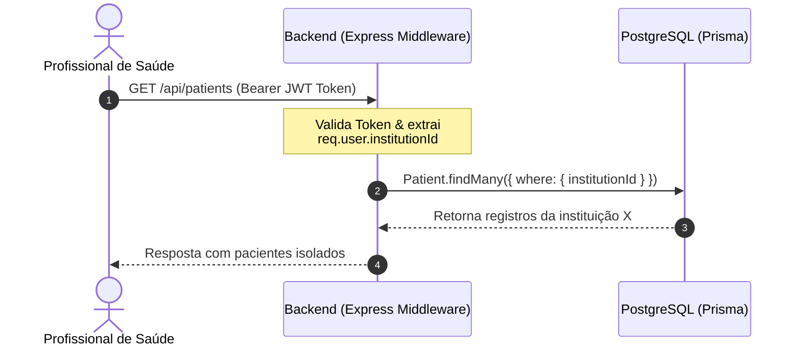
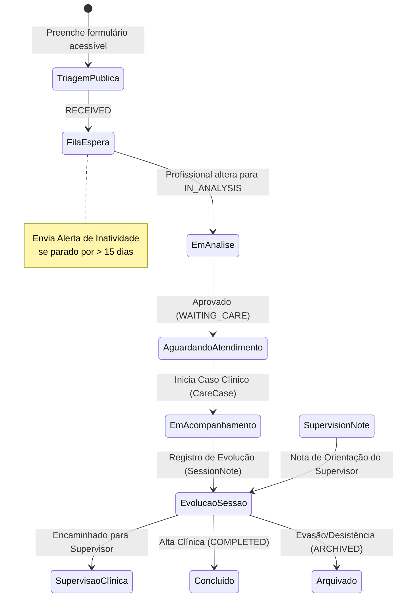

# Plano de Refatoração: Transição do Legado (PAPSE) para o NeuroAcolhe

Este documento apresenta o plano estratégico e a arquitetura detalhada para transformar o sistema legado **PAPSE** na nova plataforma **NeuroAcolhe**. O foco é a conversão do software em uma solução comercial SaaS, multi-tenant (multi-instituição), focada na acessibilidade digital para neurodivergentes, segurança de dados e conformidade estrita com a Lei Geral de Proteção de Dados (LGPD).

---

## 1. Visão Geral do Novo Domínio de Negócio

O **NeuroAcolhe** é uma plataforma SaaS para clínicas, clínicas-escola de psicologia e instituições de saúde mental. Ele gerencia de forma inclusiva e inteligente toda a jornada de acolhimento psicológico — desde a triagem pública simplificada até o acompanhamento clínico e a supervisão acadêmica/profissional.

A tabela abaixo descreve a transição de terminologias e responsabilidades:

| Conceito/Entidade Legada (PAPSE) | Novo Domínio (NeuroAcolhe) | Motivação & Melhoria de Negócio |
| :--- | :--- | :--- |
| **PAPSE** | **NeuroAcolhe** | Criação de uma marca comercial original, inclusiva e independente. |
| **Bolsista / Voluntário** | **Professional (Profissional/Estudante)** | Generalização do perfil para psicólogos juniores, residentes ou estudantes de qualquer instituição. |
| **Colaborador** | **User (Usuário)** | Estrutura unificada com controle de acesso baseado em perfis (RBAC). |
| **Docente / Coordenador** | **Supervisor** | Papel dedicado para supervisores clínicos responsáveis por emitir notas de orientação. |
| **Paciente** | **Patient (Paciente / Acolhido)** | Desacoplamento de atributos estritamente acadêmicos (`matricula`, `curso`). |
| **Lista de Espera / Regular** | **CareQueue (Fila de Cuidado)** | Fila única governada por status de transição lógica em vez de tabelas físicas duplicadas. |
| **Protocolo / Regular (Atendimento)**| **CareCase (Caso de Acompanhamento)** | Entidade genérica parametrizada por tipo (`SHORT_TERM` ou `LONG_TERM`). |
| **Relatório Evolutivo** | **SessionNote (Evolução de Sessão)** | Registros clínicos com controle de integridade (hash) e auditoria de leitura. |
| **Histórico** | *Histórico de Transições / Status* | Logs históricos embutidos na própria fila e no caso clínico, em vez de tabela separada. |
| *Não Existente* | **Institution (Instituição)** | Chave âncora para isolamento multi-tenant das organizações. |
| *Não Existente* | **AccessibilityProfile (Perfil de Acessibilidade)** | Perfil específico para registrar preferências de comunicação e sensibilidade sensorial. |
| *Não Existente* | **SupervisionNote (Orientação de Supervisão)** | Módulo para supervisores darem feedback estruturado sobre evoluções clínicas. |
| *Não Existente* | **ConsentRecord (Registro de Consentimento)** | Histórico jurídico robusto com IP, navegador e versão dos termos da LGPD. |
| *Não Existente* | **AuditLog (Log de Auditoria)** | Log de rastreabilidade imutável para conformidade com dados de saúde (LGPD). |

---

## 2. Arquitetura SaaS Multi-Instituição (Multi-Tenant)

Para suportar múltiplas organizações (clínicas, universidades e consultórios) na mesma base física de banco de dados, o NeuroAcolhe adotará a estratégia de **Isolamento de Dados em Nível de Linha (Shared Database, Shared Schema)**.

### Estratégia de Isolamento
1. A tabela `Institution` servirá como âncora.
2. Todas as tabelas transacionais e cadastrais sensíveis (`User`, `Patient`, `CareQueue`, `CareCase`, `SessionNote`, `SupervisionNote`, `Alert`, `AuditLog`) conterão a chave estrangeira `institutionId`.
3. Um middleware global no backend interceptará requisições autenticadas e injetará o `institutionId` do usuário no contexto da requisição (`req.institutionId`).
4. Todas as queries de busca, inserção ou atualização no Prisma ORM aplicarão o filtro obrigatório `{ institutionId: req.institutionId }`.



---

## 3. Estrutura do Banco de Dados (Prisma Schema)

O banco de dados será migrado do MySQL (Single-Tenant) para **PostgreSQL** para melhor suporte a concorrência e conformidade empresarial. O arquivo [schema.prisma](file:///Users/gustavoborges/Desktop/neuroacolhe-centelha-main/Backend_Papse/prisma/schema.prisma) será substituído por este novo modelo:

```prisma
// This is the new schema.prisma for NeuroAcolhe

generator client {
  provider      = "prisma-client-js"
  binaryTargets = ["native"]
}

datasource db {
  provider = "postgresql"
  url      = env("DATABASE_URL")
}

// Perfis de Acesso à Plataforma
enum UserRole {
  PLATFORM_ADMIN      // Administrador geral do SaaS
  INSTITUTION_ADMIN   // Gestor de uma clínica/instituição específica
  PROFESSIONAL        // Psicólogo, bolsista ou profissional que realiza o atendimento
  SUPERVISOR          // Docente ou supervisor clínico
}

// Estados Lógicos do Paciente na Fila de Cuidado
enum QueueStatus {
  RECEIVED            // Triagem enviada, aguardando análise inicial
  IN_ANALYSIS         // Triagem sob análise técnica de prioridade administrativa
  WAITING_CARE        // Aprovado na triagem, aguardando início de acompanhamento
  IN_CARE             // Em atendimento ativo
  SUPERVISION_PENDING // Em atendimento, necessita supervisão obrigatória
  COMPLETED           // Acompanhamento concluído com sucesso
  ARCHIVED            // Caso arquivado / desistência antes do início
}

// Tipos de Casos de Acompanhamento (Substitui Protocolo/Regular)
enum CaseType {
  SHORT_TERM          // Atendimento curto / Protocolo (ex: até 12 sessões)
  LONG_TERM           // Acompanhamento regular / Longo prazo
}

// Status do Caso Clínico
enum CaseStatus {
  ACTIVE              // Caso em andamento
  SUSPENDED           // Caso pausado temporariamente
  COMPLETED           // Caso encerrado pelo profissional
  ARCHIVED            // Caso arquivado (evasão, alta definitiva ou encaminhamento externo)
}

// Estados de Resolução de Alertas Automáticos
enum AlertStatus {
  ACTIVE
  RESOLVED
  IGNORED
}

// Tipos de Alertas do Sistema
enum AlertType {
  INACTIVE_QUEUE      // Parado na fila de espera por muito tempo
  ABSENCE_STREAK      // Faltas consecutivas registradas nas sessões
  NO_EVOLUTION        // Caso ativo sem evoluções clínicas recentes
  PENDING_SUPERVISION // Necessidade urgente de retorno do supervisor
}

// -------------------------------------------------------------
// Entidade Âncora SaaS: Instituição / Organização
// -------------------------------------------------------------
model Institution {
  id          String   @id @default(uuid())
  name        String   @db.VarChar(150)
  cnpj        String?  @unique @db.VarChar(18)
  subdomain   String?  @unique @db.VarChar(50)
  active      Boolean  @default(true)
  createdAt   DateTime @default(now())
  updatedAt   DateTime @updatedAt

  users             User[]
  patients          Patient[]
  careQueues        CareQueue[]
  careCases         CareCase[]
  sessionNotes      SessionNote[]
  supervisionNotes  SupervisionNote[]
  alerts            Alert[]
  auditLogs         AuditLog[]
}

// -------------------------------------------------------------
// Usuários Internos da Plataforma
// -------------------------------------------------------------
model User {
  id                String   @id @default(uuid())
  name              String   @db.VarChar(150)
  email             String   @unique @db.VarChar(255)
  password          String   @db.VarChar(255)
  role              UserRole @default(PROFESSIONAL)
  active            Boolean  @default(true)
  resetToken        String?  @db.VarChar(255)
  resetTokenExpires DateTime?
  createdAt         DateTime @default(now())
  updatedAt         DateTime @updatedAt

  // Isolamento Multi-Tenant
  institutionId     String
  institution       Institution @relation(fields: [institutionId], references: [id], onDelete: Cascade)

  // Relações clínicas
  casesAsProfessional CareCase[]        @relation("ProfessionalCases")
  casesAsSupervisor   CareCase[]        @relation("SupervisorCases")
  sessionNotes        SessionNote[]
  supervisionNotes    SupervisionNote[]
  auditLogs           AuditLog[]
}

// -------------------------------------------------------------
// Paciente / Acolhido
// -------------------------------------------------------------
model Patient {
  id                String      @id @default(uuid())
  name              String      @db.VarChar(150)
  email             String?     @db.VarChar(255)
  phone             String?     @db.VarChar(20)
  birthDate         DateTime    @db.Date
  responsibleName   String?     @db.VarChar(150) // Nome do responsável para menores
  responsiblePhone  String?     @db.VarChar(20)
  status            QueueStatus @default(RECEIVED)
  createdAt         DateTime    @default(now())
  updatedAt         DateTime    @updatedAt

  // Isolamento Multi-Tenant
  institutionId     String
  institution       Institution @relation(fields: [institutionId], references: [id], onDelete: Cascade)

  // Extensões de triagem, consentimento e acessibilidade
  accessibilityProfile AccessibilityProfile?
  intakeForm          IntakeForm?
  consentRecords      ConsentRecord[]
  careQueues          CareQueue[]
  careCases           CareCase[]
  sessionNotes        SessionNote[]
  alerts              Alert[]
}

// -------------------------------------------------------------
// Perfil de Acessibilidade e Preferências Neurodivergentes
// -------------------------------------------------------------
model AccessibilityProfile {
  id                      String   @id @default(uuid())
  patientId               String   @unique
  patient                 Patient  @relation(fields: [patientId], references: [id], onDelete: Cascade)
  
  // Detalhes de Neurodivergência (Autodeclarados e Opcionais)
  hasNeurodivergence      Boolean  @default(false)
  neurodivergenceDetails  String?  @db.VarChar(500)
  
  // Preferências Sensoriais e de Comunicação
  communicationPreference String?  @db.VarChar(255) // ex: Texto, Áudio, Libras, Simples
  sensorySensitivities    String?  @db.VarChar(500) // ex: Luz forte, sons repentinos
  needsAssistance         Boolean  @default(false)  // Necessidade de apoio no preenchimento do formulário
  notes                   String?  @db.Text         // Observações adicionais para o acolhimento inclusivo
  
  createdAt               DateTime @default(now())
  updatedAt               DateTime @updatedAt
}

// -------------------------------------------------------------
// Ficha de Triagem Digital Inclusiva
// -------------------------------------------------------------
model IntakeForm {
  id               String   @id @default(uuid())
  patientId        String   @unique
  patient          Patient  @relation(fields: [patientId], references: [id], onDelete: Cascade)
  
  reasonForSeeking String   @db.Text         // Descrição livre e simples do motivo da busca
  availability     String   @db.VarChar(255) // Períodos do dia/semana livres
  hasEmergencyRisk Boolean  @default(false)  // Sinalização rápida de ideação ou crise urgente
  emergencyDetails String?  @db.Text
  
  createdAt        DateTime @default(now())
  updatedAt        DateTime @updatedAt
}

// -------------------------------------------------------------
// Registro Legal de Consentimento (LGPD)
// -------------------------------------------------------------
model ConsentRecord {
  id           String   @id @default(uuid())
  patientId    String
  patient      Patient  @relation(fields: [patientId], references: [id], onDelete: Cascade)
  
  consentGiven Boolean  @default(false)
  termVersion  String   @db.VarChar(20) // Rastreabilidade do termo legal
  ipAddress    String   @db.VarChar(45) // IP de aceitação
  userAgent    String   @db.VarChar(255) // Navegador / S.O.
  acceptedAt   DateTime @default(now())
}

// -------------------------------------------------------------
// Fila de Cuidado (Status Lógicos e Histórico de Espera)
// -------------------------------------------------------------
model CareQueue {
  id            String      @id @default(uuid())
  patientId     String
  patient       Patient     @relation(fields: [patientId], references: [id], onDelete: Cascade)
  
  institutionId String
  institution   Institution @relation(fields: [institutionId], references: [id], onDelete: Cascade)
  
  status        QueueStatus @default(RECEIVED)
  notes         String?     @db.Text
  enteredAt     DateTime    @default(now())
  updatedAt     DateTime    @updatedAt
}

// -------------------------------------------------------------
// Casos de Acompanhamento Ativos (Substitui Protocolo e Regular)
// -------------------------------------------------------------
model CareCase {
  id             String      @id @default(uuid())
  patientId      String
  patient        Patient     @relation(fields: [patientId], references: [id], onDelete: Cascade)
  
  institutionId  String
  institution    Institution @relation(fields: [institutionId], references: [id], onDelete: Cascade)
  
  professionalId String
  professional   User        @relation("ProfessionalCases", fields: [professionalId], references: [id], onDelete: Restrict)
  
  supervisorId   String?
  supervisor     User?       @relation("SupervisorCases", fields: [supervisorId], references: [id], onDelete: Restrict)
  
  type           CaseType    @default(LONG_TERM)
  status         CaseStatus  @default(ACTIVE)
  startDate      DateTime    @default(now())
  endDate        DateTime?
  
  createdAt      DateTime    @default(now())
  updatedAt      DateTime    @updatedAt

  sessionNotes    SessionNote[]
  supervisionNotes SupervisionNote[]
  alerts          Alert[]
}

// -------------------------------------------------------------
// Evolução de Sessão Clínica (Dados Pessoais Sensíveis)
// -------------------------------------------------------------
model SessionNote {
  id             String      @id @default(uuid())
  caseId         String
  case           CareCase    @relation(fields: [caseId], references: [id], onDelete: Cascade)
  
  patientId      String
  patient        Patient     @relation(fields: [patientId], references: [id], onDelete: Cascade)
  
  institutionId  String
  institution    Institution @relation(fields: [institutionId], references: [id], onDelete: Cascade)
  
  professionalId String
  professional   User        @relation(fields: [professionalId], references: [id], onDelete: Restrict)
  
  content        String      @db.Text         // Conteúdo clínico descritivo da sessão
  sessionDate    DateTime    @db.Timestamp
  integrityHash  String      @db.VarChar(64)  // Hash SHA-256 para garantir que o prontuário não foi violado
  isAbsent       Boolean     @default(false)  // Se o paciente faltou à sessão
  
  createdAt      DateTime    @default(now())
  updatedAt      DateTime    @updatedAt

  supervisionNotes SupervisionNote[]
}

// -------------------------------------------------------------
// Anotações e Notas de Supervisão Clínica
// -------------------------------------------------------------
model SupervisionNote {
  id            String      @id @default(uuid())
  caseId        String
  case          CareCase    @relation(fields: [caseId], references: [id], onDelete: Cascade)
  
  sessionNoteId String?
  sessionNote   SessionNote? @relation(fields: [sessionNoteId], references: [id], onDelete: SetNull)
  
  institutionId String
  institution   Institution @relation(fields: [institutionId], references: [id], onDelete: Cascade)
  
  supervisorId  String
  supervisor    User        @relation(fields: [supervisorId], references: [id], onDelete: Restrict)
  
  content       String      @db.Text
  createdAt     DateTime    @default(now())
  updatedAt     DateTime    @updatedAt
}

// -------------------------------------------------------------
// Alertas do Sistema (Inatividade, Faltas Recorrentes, etc)
// -------------------------------------------------------------
model Alert {
  id            String      @id @default(uuid())
  type          AlertType
  status        AlertStatus @default(ACTIVE)
  message       String      @db.VarChar(500)
  
  institutionId String
  institution   Institution @relation(fields: [institutionId], references: [id], onDelete: Cascade)
  
  patientId     String?
  patient       Patient?    @relation(fields: [patientId], references: [id], onDelete: Cascade)
  
  caseId        String?
  case          CareCase?   @relation(fields: [caseId], references: [id], onDelete: Cascade)
  
  createdAt     DateTime    @default(now())
  updatedAt     DateTime    @updatedAt
}

// -------------------------------------------------------------
// Trilhas de Auditoria de Acesso e Operações (LGPD)
// -------------------------------------------------------------
model AuditLog {
  id            String      @id @default(uuid())
  userId        String?
  user          User?       @relation(fields: [userId], references: [id], onDelete: SetNull)
  
  institutionId String
  institution   Institution @relation(fields: [institutionId], references: [id], onDelete: Cascade)
  
  action        String      @db.VarChar(100) // ex: READ_CLINICAL_NOTE, DELETE_PATIENT, EXPORT_DATA
  resource      String      @db.VarChar(100) // ex: SessionNote, Patient
  resourceId    String?     @db.VarChar(100)
  ipAddress     String      @db.VarChar(45)
  userAgent     String      @db.VarChar(255)
  details       String?     @db.Text         // Detalhes não clínicos adicionais
  timestamp     DateTime    @default(now())
}
```

---

## 4. Estrutura Modular do Backend (`apps/api`)

O backend deixará de ter uma estrutura plana baseada em múltiplos arquivos soltos na raiz de `routes`, `controllers` e `services`, adotando uma arquitetura **modular e desacoplada**. 

### Estrutura de Diretórios Proposta:
```txt
apps/api/
  src/
    @types/
      express/
        index.d.ts       # Declarações para req.user e req.institutionId
    config/
      security.ts        # Configurações de Helmet, CORS e Rate Limit
    middlewares/
      auth.ts            # Validador JWT & RBAC
      tenant.ts          # Extrator do institutionId do token
      audit.ts           # Interceptor automático para Logs de Auditoria
    modules/
      auth/
        auth.routes.ts
        auth.controller.ts
        auth.service.ts
        auth.schema.ts   # Validações Zod
      institutions/
      users/
      patients/
      intake/
      care-cases/
      session-notes/
      supervision/
      alerts/
      dashboard/
      audit/
    server.ts            # Inicializador e configurações principais
    app.ts               # Setup dos middlewares express
```

Cada módulo encapsulará suas próprias regras de negócio, facilitando a manutenção isolada e os testes específicos.

---

## 5. Fluxo de Usuário e Regras de Negócio

O fluxo de atendimento é desenhado para guiar o paciente desde o primeiro contato até o encerramento do caso, permitindo intervenções e supervisão constantes:



### Detalhamento dos Fluxos Principais

#### A. Triagem Digital Inclusiva
* **Pública e Simplificada**: Um formulário web público sem login, no qual o paciente preenche dados pessoais básicos, preferências de acessibilidade e motivo da busca por atendimento.
* **Linguagem Simples**: O formulário usa linguagem curta, direta, sem jargões e com botões grandes para evitar exaustão ou sobrecarga mental.
* **Sinalização de Crise**: O sistema possui uma validação Zod que identifica relatos de urgência psiquiátrica grave e alerta imediatamente o profissional responsável administrativamente para que a triagem seja adiantada na análise.

#### B. Gestão Inteligente da Fila de Cuidado (`CareQueue`)
* Fila única e transparente que consolida o status atual do paciente na instituição.
* **Tempo de Permanência**: O sistema registra quando o paciente entrou no status atual.
* **Alertas de Abandono**: Um serviço agendado (cron ou gatilho periódico) identifica pacientes que estão há mais de 15 dias no status `RECEIVED` ou `WAITING_CARE` sem nenhuma interação administrativa e emite um alerta de inatividade para o gestor.

#### C. Criação e Gestão de Caso (`CareCase`)
* O caso é criado quando o paciente passa para o status `IN_CARE` e é vinculado a um `professionalId` e opcionalmente a um `supervisorId`.
* O caso suporta parametrização por tipo:
  * `SHORT_TERM`: Atendimento breve/focal (ex: 8 a 12 sessões).
  * `LONG_TERM`: Acompanhamento contínuo regular.
* O histórico do caso documenta todas as alterações de profissional, status e suspensões temporárias.

#### D. Supervisão Clínica e Evolução
* O profissional registra cada atendimento como `SessionNote`. 
* Cada nota criada gera uma pendência na fila de supervisão caso o usuário possua o perfil acadêmico/estudante.
* O supervisor visualiza os casos sob sua responsabilidade, lê as evoluções clínicas correspondentes (gerando log de auditoria automática) e registra a sua orientação em uma `SupervisionNote`.
* O profissional recebe a notificação da orientação no seu painel.

---

## 6. Frontend Inclusivo e Acessibilidade (`apps/web`)

O frontend do NeuroAcolhe será completamente reformulado para garantir que pessoas neurodivergentes (como autistas, pessoas com TDAH, dislexia ou deficiência cognitiva) consigam navegar e interagir sem estresse.

### Diretrizes de Acessibilidade (WCAG 2.1 AA/AAA)
* **Sem Sobrecarga Cognitiva**: Layouts limpos, sem animações dinâmicas excessivas, sem pop-ups invasivos e com muito espaço em branco.
* **Paleta de Cores Relaxantes**: Uso de cores com tonalidades pastel, azuis suaves e cinzas quentes (curadoria HSL) para evitar fadiga visual. Suporte nativo a modo escuro configurável.
* **Ajuste de Acessibilidade**: Um painel flutuante de acessibilidade que permite:
  * Alternar para fontes adequadas para dislexia (ex: *OpenDyslexic* ou *Inter* com espaçamento estendido).
  * Aumentar o tamanho do texto em até 200%.
  * Reduzir animações de transição.
  * Inverter contraste ou aplicar filtros de contraste adaptado para daltonismo.
* **Linguagem Simples**: Textos curtos com auxílio visual de ícones semânticos simples, evitando textos abstratos longos ou termos altamente acadêmicos no fluxo do paciente.
* **Leitores de Tela**: HTML 100% semântico com tags `<main>`, `<nav>`, `<section>`, `<header>`, e uso estrito de atributos `aria-label` e `aria-live` em notificações em tempo real.

### Protótipo de Design System (CSS)
```css
/* Exemplo de tokens em apps/web/src/index.css */
:root {
  /* Cores curadas - Foco no relaxamento visual */
  --bg-primary: #f8fafc;
  --bg-card: #ffffff;
  --text-main: #0f172a;
  --text-muted: #475569;
  --color-primary: #0284c7; /* Azul celeste */
  --color-success: #16a34a; /* Verde oliva suave */
  --color-warning: #ea580c; /* Laranja pastel */
  --color-danger: #dc2626;
  --border-color: #e2e8f0;
  
  /* Tipografia */
  --font-sans: 'Inter', system-ui, sans-serif;
  --line-height-accessible: 1.6;
  --letter-spacing-accessible: normal;
}

[data-theme="dark"] {
  --bg-primary: #0f172a;
  --bg-card: #1e293b;
  --text-main: #f8fafc;
  --text-muted: #94a3b8;
  --border-color: #334155;
}

[data-font-dyslexic="true"] {
  --font-sans: 'OpenDyslexic', 'Comic Sans MS', sans-serif;
  --line-height-accessible: 1.8;
  --letter-spacing-accessible: 0.12em;
}
```

### Lista de Telas Reestruturadas no Frontend
1. `/` - Landing Page institucional simplificada, direcionando o paciente para a Triagem e os profissionais para o Login.
2. `/triagem` - Formulário em etapas inclusivo, com salvamento automático de rascunho em localStorage caso o paciente precise pausar o preenchimento.
3. `/login` - Tela de acesso limpa, com suporte a preenchimento assistido e recuperação de senha segura.
4. `/app/dashboard` - Dashboard consolidado por perfil (Gestor: visão geral de tempo de fila, abandonos e faltas; Profissional: lista de casos e pendências; Supervisor: casos aguardando orientação).
5. `/app/care-queue` - Kanban ou listagem interativa de triagens recebidas, em análise e prontas para atendimento.
6. `/app/cases` - Central de prontuários com visualização em linha do tempo dos atendimentos.
7. `/app/cases/:id/session` - Formulário de evolução de sessão de fácil preenchimento com hashes gerados localmente para validação de dados sensíveis.
8. `/app/settings` - Configurações de clínica/instituição e chaves de integração.

---

## 7. Segurança, Auditoria e LGPD

Tratar dados de saúde mental exige a aplicação estrita de princípios de privacidade desde a concepção (**Privacy by Design**).

### A. Trilha de Auditoria Imutável (Audit Log)
* Toda operação que envolva a leitura ou escrita de informações em prontuários (`SessionNote` e `SupervisionNote`) disparará um middleware de auditoria que grava na tabela `AuditLog`:
  * O ID do usuário executor.
  * A ação executada (`READ_CLINICAL_NOTE`, `WRITE_CLINICAL_NOTE`, `DELETE_RECORD`).
  * O recurso e ID acessado.
  * O IP de origem e o User-Agent do dispositivo.
* Esses logs serão gravados no banco PostgreSQL e não poderão ser excluídos ou alterados pela interface do sistema.

### B. Gestão de Consentimento Ativa
* A triagem pública exibirá os termos de consentimento em linguagem clara e acessível.
* Ao submeter, o sistema registrará em `ConsentRecord` a versão exata do documento que foi aceita pelo usuário, além do IP e a assinatura digital básica (User-Agent).
* A revogação do termo poderá ser solicitada pelo paciente, gerando um status de arquivamento automático com a exclusão definitiva ou anonimização dos dados pessoais sob demanda da clínica responsável (conforme Artigo 16 da LGPD que permite retenção apenas sob dever legal ou prontuário médico ativo).

### C. Proteção da API (Hardening)
* **CORS Restrito**: A API carregará domínios permitidos a partir da variável `ALLOWED_ORIGINS` no arquivo `.env`.
* **Helmet**: Configuração de todos os cabeçalhos de segurança HTTP (XSS Protection, Content Security Policy, Frameguard contra clickjacking).
* **Rate Limit**: Implementação do middleware `express-rate-limit`:
  * Limite rígido nas rotas públicas de `/api/auth/login` (ex: máximo de 5 tentativas por minuto por IP).
  * Limite na rota pública de triagem `/api/patients/intake` (ex: máximo de 3 envios por hora por IP para evitar spam).
* **Variaveis de Ambiente**: A chave secreta do reCAPTCHA e chaves de criptografia JWT serão extraídas do código-fonte e configuradas unicamente por arquivo `.env`.

---

## 8. Estratégia de Testes Automatizados (Vitest)

A plataforma NeuroAcolhe utilizará o **Vitest** (com suporte nativo a ESM e maior velocidade) e o **Supertest** para garantir a qualidade de software.

### Escopo de Testes da API (`apps/api`)
1. **Módulo de Autenticação**:
   * Login bem-sucedido com retorno de JWT estruturado.
   * Bloqueio por credenciais incorretas e trigger de expiração.
2. **Isolamento de Tenants (SaaS)**:
   * Cenário em que o `User A` da `Instituição 1` tenta acessar por rota o `Patient B` cadastrado na `Instituição 2` e recebe um erro `403 Forbidden` ou `404 Not Found`.
3. **Módulo de Perfis (RBAC)**:
   * Usuários com perfil `PROFESSIONAL` impedidos de acessar a rota de configurações globais da instituição `/api/institutions/:id`.
   * Usuários com perfil `SUPERVISOR` autorizados a emitir anotações na rota `/api/supervision`.
4. **Triagem e Validações**:
   * Envio de triagem válida gerando corretamente o registro de paciente e aceitação de LGPD.
   * Validação de campos obrigatórios com retorno claro de erro HTTP 400 (Zod parsing).

### Exemplo de Teste de Integração (Vitest + Supertest)
```typescript
import { describe, it, expect, beforeAll } from 'vitest';
import request from 'supertest';
import { app } from '../app';

describe('Tenant Data Isolation E2E', () => {
  it('should prevent user from accessing patient records of another institution', async () => {
    // 1. Obter token do Profissional da Instituição A
    const tokenInstA = await getUserToken('prof_a@clinica-a.com');
    
    // 2. Tentar acessar o ID do paciente pertencente à Instituição B
    const response = await request(app)
      .get('/api/patients/id-paciente-da-instituicao-b')
      .set('Authorization', `Bearer ${tokenInstA}`);
      
    // 3. Deve retornar erro de permissão ou não encontrado
    expect(response.status).toBe(403);
    expect(response.body.message).toContain('Acesso negado');
  });
});
```

---

## 9. Novo README da Plataforma

O novo arquivo `README.md` principal do repositório será estruturado da seguinte forma para refletir a maturidade e a nova identidade do produto:

```markdown
# NeuroAcolhe Platform 🧩💙

> Uma plataforma SaaS multi-tenant e inclusiva para gestão de acolhimento psicológico, triagem acessível para neurodivergentes e acompanhamento clínico.

---

## 🚀 Sobre o Projeto

O **NeuroAcolhe** foi projetado para clínicas de psicologia, clínicas-escola e consultórios organizarem de forma eficiente e inclusiva a jornada de atendimento clínico. A plataforma automatiza a fila de espera, gerencia os prontuários eletrônicos com auditoria total, facilita a supervisão clínica de profissionais em formação e prioriza a acessibilidade cognitiva e digital para pacientes neurodivergentes (TEA, TDAH, Dislexia, etc.).

### Recursos Principais
- **Multi-Tenant**: Hospedagem isolada e segura para múltiplas instituições.
- **Triagem Digital Inclusiva**: Formulário em etapas de fácil leitura com salvamento de progresso e adaptação de preferências sensoriais.
- **Painel de Acessibilidade**: Interface flexível com suporte a fontes adaptadas (OpenDyslexic) e controle de sobrecarga cognitiva.
- **Fila de Cuidado Inteligente**: Fluxo de transições de status com contagem de tempo e alertas de abandono programados.
- **Supervisão Clínica**: Workflow integrado entre alunos/profissionais e docentes para revisão de prontuários.
- **Segurança & LGPD**: Registro permanente de logs de auditoria para leitura de dados sensíveis e coleta padronizada de consentimento.

---

## 📦 Estrutura de Pastas (Monorepo)

O projeto adota uma arquitetura modular moderna:

```txt
neuroacolhe-platform/
  apps/
    api/         # API REST em Node.js, Express, Prisma e PostgreSQL
    web/         # Frontend SPA em React, TypeScript, Vite e TailwindCSS
  docs/          # Documentação de arquitetura, visão de produto e auditorias
  README.md      # Instruções de setup geral da plataforma
```

---

## 🛠️ Tecnologias Utilizadas

### Backend
- **Node.js** + **TypeScript**
- **Express.js** (API framework)
- **Prisma ORM** + **PostgreSQL**
- **Zod** (Validação de schemas)
- **Vitest** + **Supertest** (Testes e asserções)

### Frontend
- **React** + **TypeScript** + **Vite**
- **TailwindCSS** (Estilização responsiva)
- **React Router** (Roteamento de rotas)
- **React Hook Form** + **Zod** (Formulários inclusivos)

---

## ⚙️ Configuração Local

### Requisitos Mínimos
- Node.js (versão 18 ou superior)
- Docker e Docker Compose

### Instalação

1. Clone o repositório:
   ```bash
   git clone https://github.com/exemplo/neuroacolhe-platform.git
   cd neuroacolhe-platform
   ```

2. Instale as dependências na raiz:
   ```bash
   npm install
   ```

3. Configure as variáveis de ambiente baseando-se nos arquivos `.env.example` localizados em `apps/api` e `apps/web`.

4. Suba o banco de dados via Docker:
   ```bash
   docker compose up -d
   ```

5. Execute as migrations do Prisma:
   ```bash
   npm run prisma:migrate --workspace=apps/api
   ```

6. Popule o banco com dados de teste neutros:
   ```bash
   npm run prisma:seed --workspace=apps/api
   ```

7. Execute o projeto em modo de desenvolvimento:
   ```bash
   npm run dev
   ```

---

## 🧪 Rodando Testes

Para executar a suíte completa de testes automatizados (unitários e de integração):
```bash
npm run test
```

## ⚖️ Licença e Governança
Este projeto é regido sob a licença MIT. O processamento de dados do prontuário atende às resoluções vigentes do Conselho Federal de Psicologia (CFP) e da Lei Geral de Proteção de Dados (LGPD).
```

---

## 10. Cronograma Recomendado de Refatoração

A migração segura do sistema atual será feita sem alterar as pastas legadas inicialmente, garantindo a construção da nova estrutura lado a lado, facilitando a portabilidade gradual:

1. **Sprint 1: Estrutura & Banco de Dados**
   - Criação da estrutura de monorepo e renomeação de diretórios principais.
   - Instalação e configuração do Prisma com o novo `schema.prisma` PostgreSQL.
   - Escrita do novo arquivo `seed.ts` com dados fictícios.

2. **Sprint 2: Core API & Multi-Tenant**
   - Implementação do setup de Express, Helmet, CORS e Rate Limit.
   - Desenvolvimento dos módulos `auth`, `institutions` e `users`.
   - Criação dos middlewares de autenticação, perfil e Tenant-Isolation.

3. **Sprint 3: Módulos Clínicos & Alertas**
   - Desenvolvimento dos módulos `patients`, `intake` (triagem), `care-cases` e `session-notes`.
   - Implementação do algoritmo de integridade (hash) para evoluções clínicas.
   - Criação do módulo de supervisão clínica e geração automática de alertas.

4. **Sprint 4: Novo Frontend & Acessibilidade**
   - Setup do frontend em React sob a pasta `apps/web`.
   - Desenvolvimento do painel de acessibilidade (ajuste de fontes, cores, contraste).
   - Criação da página pública de triagem inclusiva em etapas e das dashboards administrativas.

5. **Sprint 5: Auditoria, LGPD & Homologação**
   - Integração do middleware de `AuditLog` para auditoria total.
   - Configuração de testes automatizados unitários e de integração de ponta a ponta no Vitest.
   - Validação final do build e remoção definitiva das pastas de código legadas.
